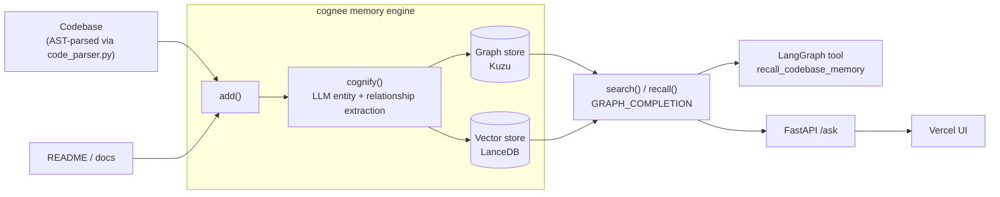

# Engram

**Persistent, graph-native engineering memory for AI coding agents — built on [cognee](https://github.com/topoteretes/cognee).**

[](LICENSE)
[](https://engram-navy.vercel.app)
[](https://github.com/topoteretes/cognee)

Most "memory for AI agents" tools are vector-similarity stores with a memory-shaped API bolted on — good for "what does this look like," bad for "what calls this," "why was it built this way," or "what did we already try and reject." Engram is a memory layer for coding agents built the other way around: on top of [cognee](https://github.com/topoteretes/cognee)'s graph-native pipeline, because call graphs, architectural rationale, and cross-session decisions are relational problems, not similarity-search problems.

## Live demo

- **UI:** https://engram-navy.vercel.app
- **API:** https://engram-api-6dxu.onrender.com

Both run against Engram's own codebase, ingested on first request. Running on free tiers: the API cold-starts after ~50s of inactivity, and LLM quota is shared across all traffic — if a query is rate-limited, the response says so explicitly rather than failing silently.

## Why graph-native memory, not vector search

cognee's built-in ingestion loaders route source code through a plain-text loader — no function/class-aware parsing, despite documentation implying otherwise (verified by reading `supported_loaders.py` directly rather than trusting the docs). So a plain `add()` on raw `.py` files gives cognee's LLM-based extraction the same undifferentiated blob a generic RAG pipeline would. Engram closes that gap with its own AST-based structural chunker ([`engram/ingest/code_parser.py`](engram/ingest/code_parser.py)): it walks a Python file's syntax tree and turns every function and class into its own chunk, tagged with its qualified name, docstring, and the calls it makes — so cognee's graph-extraction step has actual structure to build a graph from, not text to guess at.

The payoff shows up directly in retrieval. In a self-referential test, Engram's own [LangGraph tool](engram/agent/langgraph_agent.py) was asked what it does and what it calls — and answered correctly, by querying the graph built from its own source:

> **Q: What does `recall_codebase_memory` do and what does it call?**
> **A:** "`recall_codebase_memory` searches Engram's cognee-backed knowledge graph for architectural context, call-graph relationships, or past session decisions. It calls `cognee.search` (as well as `join` and `str`)."

That's a real multi-hop answer (function → its call sites → a synthesized explanation), not a substring match.

## Architecture



## What's built and live-validated

Everything below has actually been run end to end against a live LLM (Gemini), not just written:

- [x] AST-based code chunker — self-tested against Engram's own source
- [x] `add` → `cognify` → `search` / `recall` — full pipeline, incremental graph growth across separate ingestion runs confirmed
- [x] Static graph visualization (`cognee.visualize_graph()`) — self-contained HTML, no server required
- [x] LangGraph tool wrapping `cognee.search()` — schema-verified and functionally tested
- [x] FastAPI backend + static frontend, deployed to Render + Vercel
- [ ] Full graph-vs-vector eval (methodology below; first question validated, full 5-question run blocked on shared LLM quota)
- [ ] Git-history and session-log ingestion (commits and past agent sessions as graph nodes)
- [ ] MCP server exposure for direct use from Claude Code

## Quickstart

```bash
git clone https://github.com/Aymanunischolar/engram.git
cd engram
python -m venv .venv && .venv/Scripts/activate  # or source .venv/bin/activate
pip install -e ".[dev]"
cp .env.example .env  # fill in LLM_API_KEY (OpenAI or Gemini both documented)
python examples/quickstart.py
```

On Windows, `GRAPH_DATABASE_SUBPROCESS_ENABLED=false` in `.env.example` is required — see the comment there for why.

## Eval methodology

Per cognee's own claim that graph-completion retrieval beats plain-vector RAG, Engram runs the same hand-written question through both `SearchType.GRAPH_COMPLETION` and `SearchType.RAG_COMPLETION` (cognee's built-in vector-only mode) and compares them side by side — see [`engram/eval/`](engram/eval/). Target: Engram's own codebase, since it's a real repo with real history that's also fully inspectable by anyone checking the results. Full comparison table is blocked on the same shared LLM quota noted above; re-running `python engram/eval/run_eval.py` once quota resets will populate `engram/eval/results.md`.

## Tech stack

| Layer | Choice | Why |
|---|---|---|
| Memory engine | [cognee](https://github.com/topoteretes/cognee) 1.4.1 | Graph-native extraction/retrieval pipeline |
| LLM / embeddings | Gemini (OpenAI also supported) | Cost-effective for iteration; both documented in `.env.example` |
| Graph store | Kuzu | cognee's own default (`ladybug`) hit a Windows-specific native-extension bug; Kuzu is the confirmed-stable fallback |
| Vector store | LanceDB | Zero-infra embedded default |
| Agent orchestration | LangGraph | Tool-calling interface for coding agents |
| Backend | FastAPI on Render | `/ask` endpoint, rate-limited, cold-start-tolerant |
| Frontend | Static HTML on Vercel | Zero build step, minimal surface area |

## Roadmap

Git-history-aware ingestion (linking commits to the code they touched), agent session-log memory (so Engram remembers what a past session already tried), and an MCP server so Claude Code and other MCP clients can query Engram directly.

## License

MIT — see [LICENSE](LICENSE).
